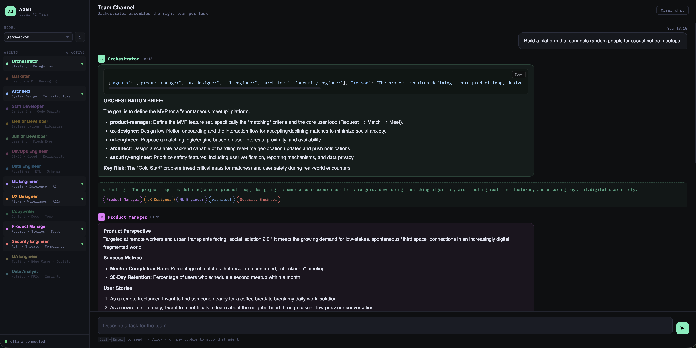

# AGNT — Local AI Team Messenger

A single-file browser app that runs a virtual product team powered by local LLMs via [Ollama](https://ollama.com). Type a task, and the Orchestrator assembles the right agents, delegates work, and each specialist streams their response live — token by token.

No backend. No API keys. No cloud. Everything runs on your machine.



---

## Demo

A live demo is available at **https://scrumcoin.github.io/agnt**

> **Requires a locally running [Ollama](https://ollama.com) instance!**
> 
> To allow the demo page to connect to your local Ollama, start it with:
>
> ```bash
> OLLAMA_ORIGINS="https://scrumcoin.github.io" ollama serve
> ```

---

## How it works

1. You type a task in the input box
2. The **Orchestrator** analyzes it and picks the relevant agents (from a roster of 15)
3. A routing banner shows which agents were selected and why
4. Each selected agent streams their response live into their own chat bubble
5. You can stop any agent mid-generation by clicking the ✕ on their bubble

---

## Agents

| Agent | Domain |
|---|---|
| Orchestrator | Strategy · Delegation |
| Marketer | Brand · GTM · Messaging |
| Architect | System Design · Infrastructure |
| Staff Developer | Senior Eng · Code Quality |
| Medior Developer | Implementation · Libraries |
| Junior Developer | Learning · Fresh Eyes |
| DevOps Engineer | CI/CD · Cloud · Reliability |
| Data Engineer | Pipelines · ETL · Schemas |
| ML Engineer | Models · Inference · AI |
| UX Designer | Flows · Wireframes · A11y |
| Copywriter | Content · Docs · Tone |
| Product Manager | Roadmap · Stories · Scope |
| Security Engineer | Auth · Threats · Compliance |
| QA Engineer | Testing · Edge Cases · Quality |
| Data Analyst | Metrics · KPIs · Insights |

The Orchestrator typically activates 2–5 agents per task based on what's genuinely relevant. A marketing brief gets the Marketer, Copywriter, and Product Manager. A backend feature gets the Architect, Staff Developer, DevOps, and Security Engineer.

---

## Requirements

- [Ollama](https://ollama.com) running locally on port `11434`
- At least one model pulled, e.g.:

```bash
ollama pull llama4
ollama pull qwen3.6
ollama pull gemma4:27b
```

- A modern browser (Chrome, Firefox, Safari, Edge)

---

## Usage

### Option A — GitHub Pages

Just open the published URL. Make sure Ollama is running locally and has CORS enabled (see below).

### Option B — Local file

```bash
git clone https://github.com/scrumcoin/agnt
open agnt/index.html
```

Or drag `index.html` into your browser.

---

## Ollama CORS setup

When opening from GitHub Pages (or any `https://` origin), the browser will block requests to `localhost:11434` unless Ollama is configured to allow it.

Set the allowed origins before starting Ollama:

```bash
# Allow GitHub Pages origin (replace with your actual Pages URL)
export OLLAMA_ORIGINS="https://your-username.github.io"

# Or allow all origins during development
export OLLAMA_ORIGINS="*"

ollama serve
```

On macOS you can make this permanent via `launchctl`:

```bash
launchctl setenv OLLAMA_ORIGINS "*"
```

Then restart Ollama.

---

## Running on multiple machines

If you have multiple computers on the same network, you can run Ollama on each and point the app at different hosts. By default the app connects to `localhost:11434`. To use a remote Ollama instance, edit the fetch URLs in `index.html`:

```js
// Change this in two places near the bottom of the <script> block:
'http://localhost:11434/api/...'
// to:
'http://192.168.1.10:11434/api/...'
```

On the remote machine, start Ollama with:

```bash
OLLAMA_HOST=0.0.0.0:11434 ollama serve
```

---

## Model selection

The sidebar dropdown is populated from your locally available Ollama models at startup. Your selection is remembered in a cookie.

Recommended models by use case:

| Use case | Model                              |
|---|------------------------------------|
| Best reasoning (orchestration) | `qwen3.6:27b`, `llama4`            |
| Balanced quality/speed | `qwen3.6:35bb`, `gemma4:26b`       |
| Code-focused tasks | `qwen3.6:35b-a3b-mlx-bf16`         |
| Fast responses | `gemma4`, `mistral:7b`, `phi4:14b` |

---

## GitHub Pages deployment

1. Fork or clone this repo
2. Go to **Settings → Pages**
3. Set source to `main` branch, `/ (root)` folder
4. Save — your app will be live at `https://your-username.github.io/agnt`

Remember to configure `OLLAMA_ORIGINS` on your local machine to allow the Pages origin (see above).

---

## Customizing agents

All agent definitions are in the `ALL_AGENTS` array near the top of `index.html`. Each agent has:

```js
{
  id: 'my-agent',          // unique ID used for routing
  name: 'My Agent',        // display name
  abbr: 'MA',              // 2-letter avatar
  color: '#hex',           // accent color
  domain: 'Tag · Tag',     // shown in sidebar
  systemPrompt: `...`      // the actual persona and instructions
}
```

To add a new agent, add an entry to `ALL_AGENTS` and add the `id` to the Orchestrator's system prompt list of available agents.

---

## License

MIT
